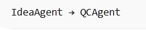
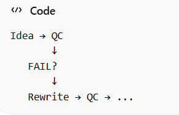
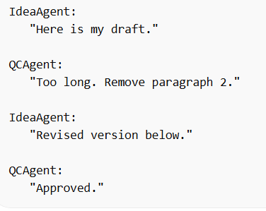

This repo is my learning about AI agents.

1. Agent content facebook

**Use case**
Demo multi agents for content facebook creator:

- Agent content: base on topic provided, generate content

- Agent QC: quality control of content generated, if pass go next, if not try to re-generate till max retires reached.

**Running**:

There are 3 type of running in this demo:
- demo_level_1: Sequential agents    

- demo_level_2: Feedback loop:   

- demo_level_3: Conversational Agents:  

